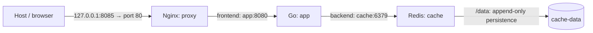

# Docker Visitor Counter

Completed successfully on **2026-09-12** as the practical project after Docker Lessons 01–12 and the comprehensive Docker checkpoint.

This containerized visitor counter combines a Go HTTP application, an Nginx reverse proxy, and Redis. Each request handled by the counter increments the Redis `visits` key and returns the configured message and visit count.

## Architecture



| Service | Role | Networks | Published host port |
|---|---|---|---|
| `proxy` | Nginx forwards requests to `app:8080`. | `frontend` | `127.0.0.1:8085` → container port `80` |
| `app` | Go serves HTTP on `8080` and increments the Redis counter. | `frontend`, `backend` | None |
| `cache` | Redis stores the counter on port `6379`. | `backend` | None |

Only Nginx publishes a host port, bound to loopback. The application and Redis have no published host ports. `EXPOSE 8080` in the Dockerfile is image metadata; it does not publish a port.

`proxy` and `app` share `frontend`; `app` and `cache` share `backend`. Docker service-name DNS lets each service find peers on shared networks. `proxy` cannot resolve `cache` because they do not share a network. The application uses both networks to handle HTTP and Redis connections; it does not automatically route traffic between them.

## Files and configuration

| File | Purpose |
|---|---|
| `main.go` | HTTP handlers and a small Redis `INCR` client using the Go standard library. |
| `Dockerfile` | Multi-stage application build. |
| `compose.yaml` | Services, ports, networks, volume, environment, and health checks. |
| `.dockerignore` | Excludes `.git`, Markdown files, `compose.yaml`, and `nginx/` from the build context. |
| `nginx/default.conf` | Reverse proxy and Nginx health endpoint. |

The builder uses `golang:1.26-alpine` and runs `CGO_ENABLED=0 go build -o /app main.go`. The final stage starts from `alpine:3.22` and copies only `/app` from the builder. The final image contains Alpine and the compiled `/app` binary, but no Go compiler or application source code. The image is tagged `docker-visitor-app:1.0`.

Redis runs with `--appendonly yes` and stores its data in `/data`, backed by the `cache-data` named volume. Ordinary `docker compose down` removes containers and networks while preserving this volume. Removing the volume deletes the saved counter.

Nginx uses the bind mount `./nginx/default.conf:/etc/nginx/conf.d/default.conf:ro`. The `ro` option prevents writes through the container's mounted path.

The application receives these non-secret environment variables from Compose:

| Variable | Compose value | Purpose |
|---|---|---|
| `REDIS_ADDR` | `cache:6379` | Redis service name and container port. |
| `APP_MESSAGE` | `Docker visitor counter is running` | First line of the HTTP response. |

If a variable is absent or empty, the Go defaults are `cache:6379` and `Docker mini-project`, respectively. Edit the Compose environment values and apply them with `docker compose up -d`; a simple restart does not apply changed container configuration. Environment variables are configuration, not secure secret storage, and can be visible to users with Docker access.

## Health checks and startup

| Service | Check | What it verifies |
|---|---|---|
| `cache` | `redis-cli ping` | Redis responds to its protocol. |
| `app` | HTTP GET `http://127.0.0.1:8080/health` | The Go HTTP server responds. |
| `proxy` | HTTP GET `http://127.0.0.1/nginx-health` | Nginx serves its local health endpoint. |

Each check runs every `5s`, with a `3s` timeout and `5` retries. `depends_on` with `condition: service_healthy` makes the application wait for healthy Redis at startup and Nginx wait for a healthy application.

These conditions control startup ordering. They do not continuously restart dependent services when a dependency becomes unhealthy. The app health endpoint does not query Redis, and the Nginx health endpoint does not query the app. Use a counter request to test the complete path. Health endpoint requests do not increment the counter.

## Build and start

Prerequisites: Docker Engine running and the Docker Compose plugin installed. Run the commands below from this project directory; from the repository root:

```bash
cd Projects/docker-visitor-counter
docker compose config --quiet
docker compose up -d --build --wait
```

`config --quiet` validates the configuration without starting services. `up` builds the app, creates the project resources, and starts the services; `--wait` waits for them to become healthy. Docker performs compilation, so a host Go installation is not required.

## Inspect and test

```bash
docker compose ps
docker compose images
docker image ls docker-visitor-app:1.0
docker image history docker-visitor-app:1.0
docker inspect $(docker compose ps -q)
docker compose exec proxy nginx -t
curl --fail http://127.0.0.1:8085/nginx-health
curl --fail http://127.0.0.1:8085/health
```

The default project name is `docker-visitor-counter`, derived from the directory name. With that default, inspect network membership and storage using:

```bash
docker network inspect docker-visitor-counter_frontend docker-visitor-counter_backend
docker volume inspect docker-visitor-counter_cache-data
```

If you override the project name, use the corresponding resource names. `docker inspect` includes health-check output, network membership, mounts, and port bindings.

For a fresh volume, make exactly two counter requests:

```bash
curl --fail http://127.0.0.1:8085/
curl --fail http://127.0.0.1:8085/
```

The responses contain the configured message, followed by `Visits: 1` and `Visits: 2`. Additional counter requests, including browser requests for other paths such as `/favicon.ico`, can increase the value because the Go `/` handler also handles unmatched paths.

Test service connectivity without incrementing the counter:

```bash
docker compose exec proxy wget -qO- http://app:8080/health
docker compose exec proxy nslookup cache
echo $?
docker compose exec app nc -z -w 2 cache 6379
echo $?
```

The proxy should reach the app. Resolving `cache` from the proxy should fail with exit code `1`; app-to-cache TCP connectivity should succeed with exit code `0`. The TCP check verifies connectivity, while counter requests also exercise the Redis protocol.

Inspect the mount's `RW: false` field with `docker inspect`. In the completed lab, an attempted write to the mounted Nginx configuration failed with `Read-only file system` and exit code `1`.

## Logs

```bash
docker compose logs --tail 30 proxy app cache
docker compose logs --follow --tail 10 app cache
```

Press `Ctrl+C` to stop following logs; this does not stop the services.

## Test persistence

After the two counter requests above, recreate the containers while keeping the named volume:

```bash
docker compose down
docker compose up -d --wait
curl --fail http://127.0.0.1:8085/
```

The next response should contain `Visits: 3` if no other counter requests occurred. This verifies that Redis data survives container removal and recreation. Do not use `--volumes` during this test.

## Cleanup

To finish the lab and delete its saved counter, run:

```bash
docker compose down --volumes
docker image rm docker-visitor-app:1.0
docker compose ps -a
docker network ls --filter label=com.docker.compose.project=docker-visitor-counter
docker volume ls --filter label=com.docker.compose.project=docker-visitor-counter
docker image ls docker-visitor-app:1.0
ss -lnt 'sport = :8085'
```

This removes the three containers, two project networks, named volume, and locally built application image. The verification listings should have no matching resources or listener on port `8085`. The cleanup does not request removal of shared base images or global build cache.

## Troubleshooting

| Symptom | Explanation and check |
|---|---|
| Host port is already allocated | Check `ss -lnt 'sport = :8085'` and `docker ps`. Identify the owner before stopping anything. If you choose a different host port in Compose, update the test URLs too. |
| Service name does not resolve | Check spelling and shared network membership. Use `app:8080` from the proxy and `cache:6379` from the app. The proxy's inability to resolve `cache` is expected isolation. Compose names are not normal host DNS names. |
| Connection to `localhost` fails | Inside a container, `localhost` refers to that container. The app must use `cache:6379` to reach Redis. Localhost is correct for the health checks because they check a server in the same container. |
| A service remains unhealthy or startup waits | Read `docker compose ps`, service logs, and `.State.Health` in `docker inspect`. Check the endpoint, listening port, and dependency. A healthy app endpoint alone does not prove Redis is available; a counter request returns HTTP `503` if Redis access fails. |
| Redis logs a `vm.overcommit_memory` warning | This warning was observed in the lab and was non-blocking: Redis became healthy and persistence checks passed. It concerns host memory allocation for Redis background operations. No host sysctl settings were changed. |

## Verified results — 2026-09-12

These results were verified during the completed practical lab. The project was cleaned up afterward; documenting it did not rerun the containers.

| Check | Recorded result |
|---|---|
| Application image | `25.8 MB` disk usage; `8.45 MB` content size. These are different measurements. |
| Health checks | `proxy`, `app`, and `cache` all passed. |
| Nginx configuration | `nginx -t` passed. |
| Initial requests | `Visits: 1`, then `Visits: 2`. |
| Persistence after Compose down/up | Next request returned `Visits: 3`. |
| Proxy → app | Reached `app:8080`. |
| Proxy → cache DNS | Could not resolve `cache`; no shared network; exit code `1`. |
| App → cache | Connected to `cache:6379`; exit code `0`. |
| Nginx configuration write | Failed with `Read-only file system`; exit code `1`. |
| Published host ports | Only `127.0.0.1:8085`. |
| Final cleanup | Three containers, two project networks, named volume, and locally built app image removed; port `8085` released. |
| Host configuration | No sysctl settings changed. |

Docker Lessons 01–12 are complete, the comprehensive checkpoint was passed with approximately **9/10**, and this mini-project completed the Docker block. The next major learning block is **Python for DevOps**. See the [Docker notes](../../DevOps/Docker.md) for checkpoint strengths and review areas.
